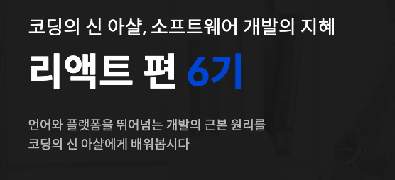
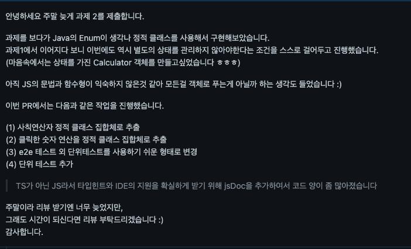
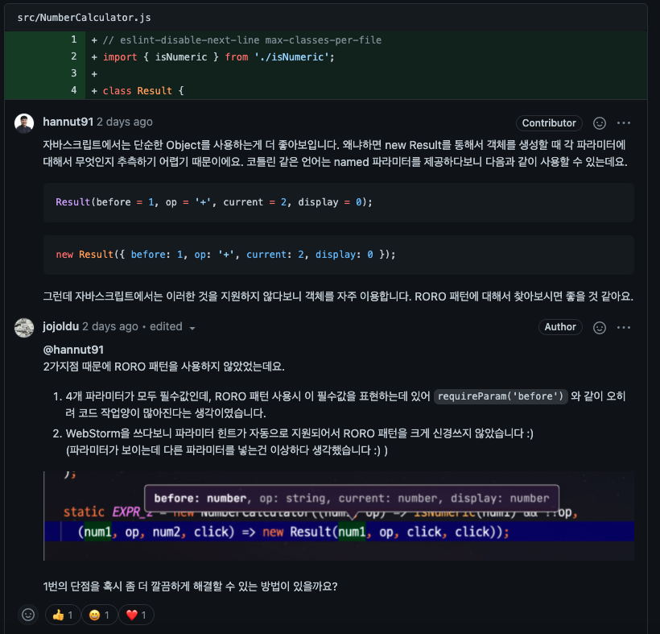

# 1. 코드숨 리액트 - 1주차

사내의 프론트엔드 팀원들과 함께 [코드숨의 리액트 과정](https://www.codesoom.com/courses/react)을 수강하게 되었다.

> 코드숨의 과정은 220만원인데 (부가세포함) 조금 자랑하자면, [사내 복지로 성장지원금(연 180만원)](https://www.notion.so/inflab/07f853bd79c14f688e30b7b634ff7b4a)을 지원해서 몇몇 팀원들은 이를 활용했다.  

## 학습 내용

1주차의 경우 기본 개발환경을 습득한다.

* Node.js
* NPM
* Webpack Dev Server
* ESLint

이외에 간단한 과제를 위해 **웹개발, JSX**를 학습한다

* 기본적인 JS Syntax
  * Array
  * Rest parameters
  * Spread syntax
* Babel
* JSX

바로 리액트를 시작하지 않고, `.js` 에서 JSX 문법을 시작하는 것은 프론트엔드를 리액트로만 해본 분들에겐 좋은 기초를 잡아줄 수 있다고 생각했다.

## 과제 & 코드리뷰

과제에 대해서는 상세하게 얘기하면 안될것 같아 조심스럽다.  

## 회고

* 모던 웹 프론트엔드의 기초부분부터 시작해서 다른 교육기간을 통해 기본적인 html/css/js를 배웠다면 1주차는 무난하게 진행할 수 있을것 같다
* 딱딱딱 되는 것만 보여주는게 아니라, "자 이렇게 하면 에러가 나죠? 이 에러를 고칠려면~~" 식으로 하기 때문에 초보자들이 에러를 만나는 것에 대한 두려움을 낮춰주는 느낌을 받았다
* `props` 에서 `class` 가 아닌 `className` 을 쓰는걸 권장하는 이유 (`class`가 예약어라서) 와 같이 의문을 삼을 만한 부분을 강의 중간중간에 설명을 해주시기 때문에 잦은 Q & A 없이 과정을 소화할 수 있다.
