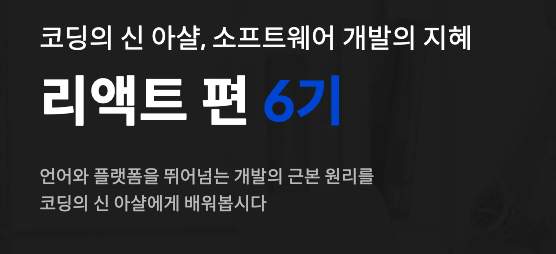
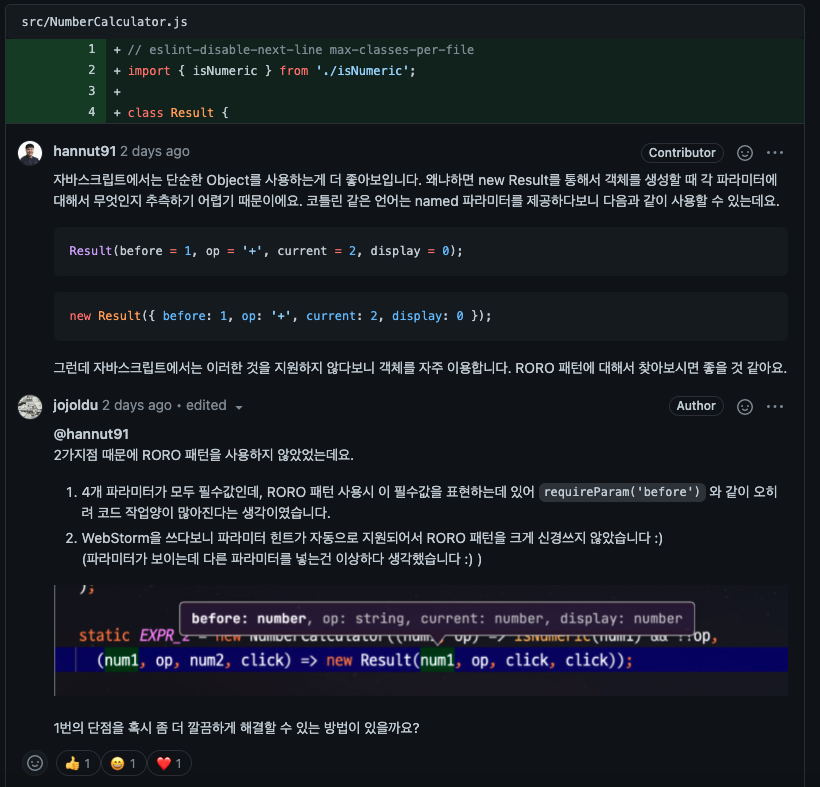

# 1. 코드숨 리액트 - 1주차

사내의 프론트엔드 팀원들과 함께 [코드숨의 리액트 과정](https://www.codesoom.com/courses/react)을 수강하게 되었다.

> 코드숨의 과정은 220만원인데 (부가세포함) 조금 자랑하자면, [사내 복지로 성장지원금(연 180만원)](https://www.notion.so/inflab/07f853bd79c14f688e30b7b634ff7b4a)을 지원해서 몇몇 팀원들은 이를 활용했다.  

커리어 내내 백엔드 애플리케이션을 중심으로 해서 데이터베이스 설정이나 쿼리튜닝, 서버 아키텍처 등을 위주로 해왔다.  
내가 그간 해왔던 프론트엔드 개발이라고 해봐야, jQuery -> Backbone.js & Handlebar.js -> Angular 1 -> Vue.js 로 그때그때 필요한 프론트엔트 작업을 했을 뿐이다.  

그래서 이 강의를 듣는다고 했을때 주변에서는 "으잉? 왜??" 라는 이야기를 하셨다.  

국내에서 프론트엔드의 TDD/클린아키텍처에 관한 내용을 포함해서 알려주는 강좌가 흔하지 않다.  
거의 대부분 React를 통해 웹 서비스를 만드는 과정이다보니 **Hook/함수형컴포넌트 기반의 React 환경에서는 테스트 하기 좋은 코드를 어떻게 구성할것인가**에 대한 내용을 찾기가 어렵다.  

그래서 현재의 FE 파트와 이런 저런 코드에 대한 이야기를 하다보면, "내가 너무 백엔드 아키텍처를 배경으로 해서 이야기하는 것인가?", "현대의 프론트엔드 환경과 백엔드는 완전히 멀리 떨어졌나?" 등에 대해 스스로 의심하게 되었다.  

나는 여전히 어느 분야든 테스트 하기 좋은 코드 / 좋은 아키텍처 / 좋은 코드에 대해서는 디테일한 부분은 다를 수 있을지언정, 크게는 비슷하다고 생각하기 때문에 이 과정은 그 생각이 맞는지 검증해볼 수 있는 시간이 될 것 같았다.  

당연히 내가 잘못알고 있거나, 오해하고 있는 부분들도 이 수강기간동안 많이 교정할 예정이다.  

그리고 팀원들과 함께 성장하는 문화를 만들고 싶다.  
결국 나는 대규모 트래픽을 메인으로 한 백엔드 서버 개발자를 배경으로 하고 있다.  
그러다보니 백엔드 혹은 데브옵스에 비해 **프론트엔드 개발자분들은 상대적으로 나와 공감대 형성이 어려우실것 같다**라고 생각한다.  

그런 상황에서 내가 프론트엔드 개발자분들에게 해줄 수 있는 것은 **자세**라고 생각했다.  

* 같이 공부 하는 문화
* 필요한게 있으면 돈/시간을 써서라도 빠르게 내 것으로 만드는게 당연한 문화
* 연차와 관계 없이 배움을 청하는 문화

등등을 입으로 얘기하는 것은 의미가 없다.  
내가 먼저 그렇게 하는것을 보여주는게 의미가 있다.  

그래서 빠르게 신청할 수 있었다.  

여담이지만, 코드리뷰를 베이스로 한 과정이다 보니 **많은 분들에게 내 코드를 공개**해야만 한다.  
그러다보니 내가 작성한 프론트엔드 코드를 보고 "이분은 연차가 이정도나 되는데 코드 퀄리티가 왜이러지?" 라는 생각을 트레이너분이나 같이 수강하시는 분, 혹은 팀 동료가 할 수도 있지 않을까 생각했다.  
그래서 처음에 할까말까 **잠깐** (진짜 잠깐이였다) 고민도 했었다.  

근데 "체면이 안서서", "부끄러워서" 등의 이유로 배울 기회 놓치는게 더 바보같은 선택이라는걸 잘 알고 있다.  
그리고 어차피 이런 감정선은 매년 연차가 쌓이면 쌓일수록 더더욱 심해질뿐이다.  

이미 남들이 잘 정리하고 가공해서 떠먹기만 하면 되는데도 "체면 차린다고 먹지도 않는게 더 바보아닌가?" 라는 생각을 하고 있어서 정말 찰나만 고민하고 바로 신청했다.

> 내년에는 데브옵스 파트와 함께 들을 강좌도 정해두었다.

## 1. 학습 내용

1주차의 경우 기본 개발환경을 습득한다.

* Node.js
* NPM
* Webpack Dev Server
* ESLint

이외에 간단한 과제를 위해 **웹개발, JSX**를 학습한다

* 기본적인 JS Syntax
  * Array
  * Rest parameters
  * Spread syntax
* Babel
* JSX

바로 리액트를 시작하지 않고, `.js` 에서 JSX 문법을 시작하는 것은 프론트엔드를 리액트로만 해본 분들에겐 좋은 기초를 잡아줄 수 있다고 생각했다.

## 2. 과제 & 코드리뷰

과제에 대해서는 상세하게 얘기하면 안될것 같아 조심스럽다.  
그래서 과정만 이야기 하자면,  
매 주 과제가 나오고, 이 과제를 제출하면 코드리뷰를 진행하고, 이에 대한 회고글을 작성하는 과정을 가진다.  
(지금 이 글도 그 과정의 일환이다.)

코드 리뷰 과정도 좋았지만, 내가 이 코드를 작성했을때 고려한 부분을 트레이너분과 함께 토론 하는 과정이 더 좋았다.  

그리고 막상 내가 작성하다가, 타인에게 했던 리뷰를 내가 바쁘다는 핑계로 / 실제 서비스 코드가 아니니깐 하는 핑계로 안지키고 있는 것을 발견하게 되었다.  
과제에 대해서는 조금 더 진지하게 해야겠다는 다짐을 하는 계기였다.

## 3. 회고

* 모던 웹 프론트엔드의 기초부분부터 시작해서 다른 교육기간을 통해 기본적인 html/css/js를 배웠다면 1주차는 무난하게 진행할 수 있을것 같다
* 되는 것만 보여주는게 아니라, "자 이렇게 하면 에러가 나죠? 이 에러를 고칠려면~~" 식으로 하기 때문에 초보자들이 에러를 만나는 것에 대한 두려움을 낮춰주는 느낌을 받았다
* `props` 에서 `class` 가 아닌 `className` 을 쓰는걸 권장하는 이유 (`class`가 예약어라서) 와 같이 **의문을 삼을 만한 부분을 강의 중간 중간에 설명**을 해주시기 때문에 잦은 Q & A 없이 과정을 소화할 수 있다.

어찌됐든 나는 프론트엔드 개발에 있어서는 초짜이기 때문에 괜히 어설프게 아는 척 하지말고, 최대한 많은 것을 흡수하려고 한다.  
아는척하다가 배우는 걸 놓치는것만큼 바보같은 선택은 없다고 생각한다.
