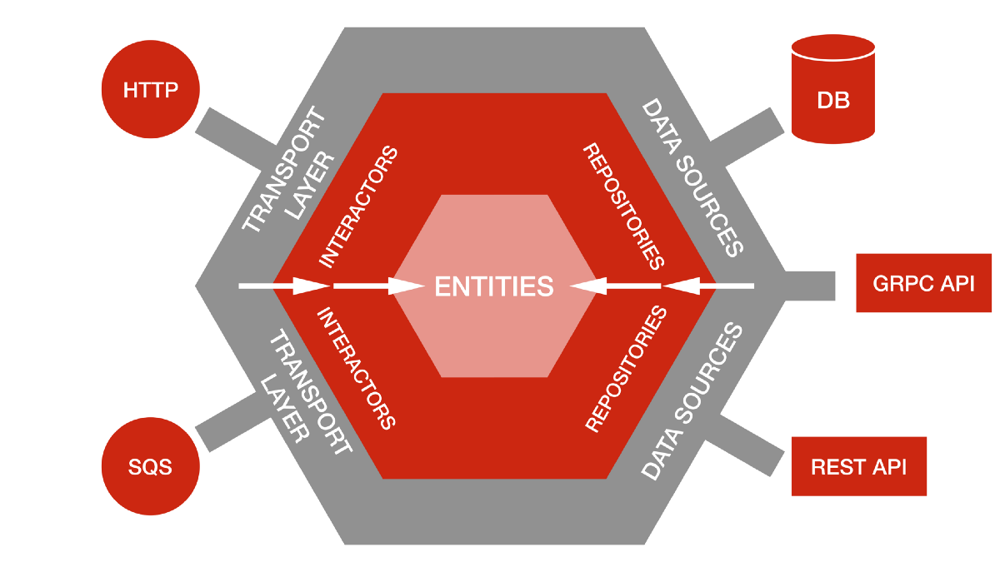
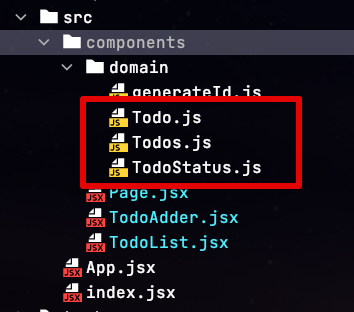
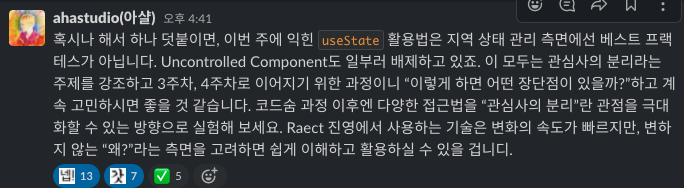

# 2. 코드숨 리액트 - 2주차

## 1. 학습 내용

2주차의 경우 React와 그 생태계에 대해서 배우게 됐다.

* React & React Dom
* 함수 Components & Props
* React Hook
* 선언형 프로그래밍
* 관심사 분리

관심사 분리를 2주차에 바로 언급해주신게 좋았다.  

특정 라이브러리 사용법 보다 더 중요한게 **어떤 코드를 어디에 배치할 것인가** 하는 디자인에 관한 것이라고 생각한다.

* [객체지향 (Object Oriented) 디자인 (Design)](https://jojoldu.tistory.com/592)

그런 면에서 교육 과정 초반에 바로 코드 디자인에 관한 내용을 언급해주셔서 좋다고 생각했다.

이와 별개로 함수형 컴포넌트를 사용해 보면서 **함수형 컴포넌트를 쓰는 것과 함수형으로만 코드를 작성하는 것을 오해하실 수도 있겠다**는 생각을 했다.

> 물론 기존 클래스형 컴포넌트 방식처럼 상속으로 `extends React.Component` 로 처리하는 것에 동의한다는 것은 아니다.  
> [EJB 코드](https://www.baeldung.com/spring-bean-vs-ejb)인줄 알았다.

함수형 컴포넌트를 쓴다고 해서 모든 코드를 함수 단위로만 작성하고 "**절대 클래스를 생성하면 안된다**" 라고 오해를 해선 안될 것 같다.  

모든 데이터 핸들링을 리터럴객체 (JSON 객체)로만 하는 것은 응집력 있는 코드가 되기는 어렵다고 생각한다.  
그래서

## 2. 과제 & 코드리뷰

나는 도메인 (비지니스) 영역에 라이브러리가 침투하는걸 좋아하지 않는다.  
우리의 도메인 코드는 외부 영향을 받지 않는 형태로 유지해야만, **테스트 하기 좋고, 특정 라이브러리에 의존적이지 않은 코드가 된다**고 생각한다.

(출처: [Netflix Tech Blog](https://netflixtechblog.com/ready-for-changes-with-hexagonal-architecture-b315ec967749))

만약 hook, 상태관리 등의 라이브러리 코드가 도메인 코드에 침투하게 되면 해당 라이브러리들이 교체 될때마다 어마어마한 교체 비용이 필요하다고 생각했다.

> 제일 흔한게 redux => mobx 로 변환 등일것 같다.

그래서 과제로 주는 아주 작은 애플리케이션에서도 도메인 계층과 서비스 계층을 분리하려고 했다.  

코드숨 과정을 함께 듣는 팀원들과 스터디 회고를 할때도 전달한 이야기이기도 한데,

과제를 하면서도 **도메인을 최대한 보호하면서 리액트를 적용**할 계획이다.

## 3. 회고

진행하는 과정에서 이 구조는 납득이 안되는데? 하는 부분도 있었다.  
물론 교육 과정중에 있다보니 **안좋은 구조에서 점점 좋은 구조로 가겠지?** 라는 생각을 하고 진행했었다.  
마침 아샬님이 그 얘기를 해주셔서 어떤 구조로 개선되려나 하는 생각이 있다.

