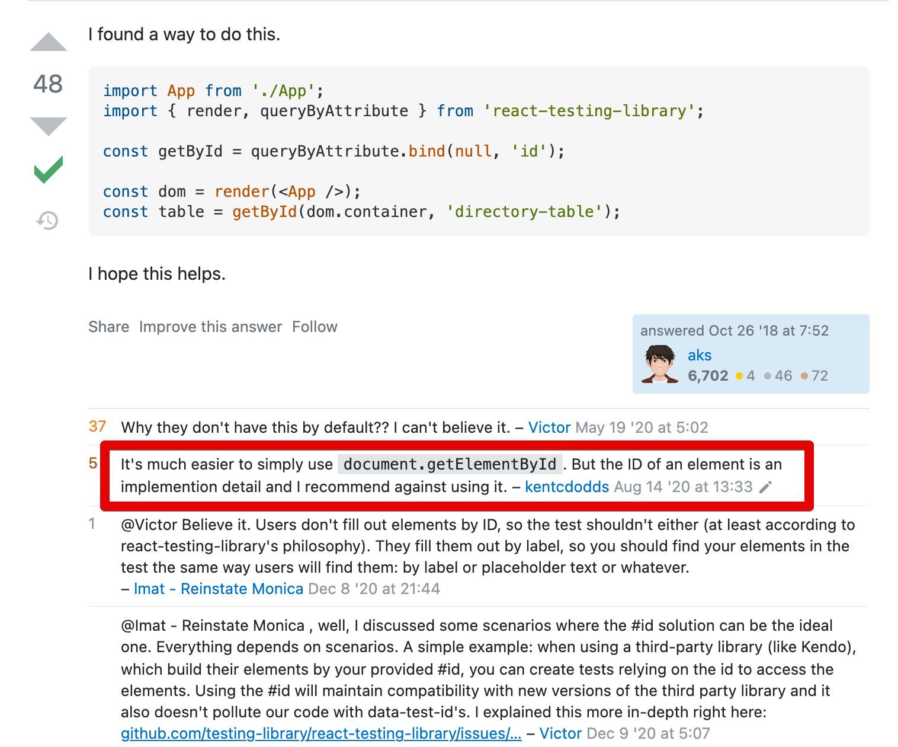

# 3. 코드숨 리액트 - 3주차

## 1. 학습 내용

드디어 FE (정확히는 React) 에서의 TDD를 배우게 되었다.  
아래 내용들을 배웠다.

* Jest
* React Testing Library
* TDD

## 2. 과제 & 코드리뷰

이번주는 일요일 새벽에 제출하다보니 코드리뷰를 받지 못했다 ㅠ  
다만 과제를 하는 과정에서 배운것이 있다.  
  
### getByRole?

React Testing Library를 사용하던 중에, 왜 `getByRole`은 있는데 `getById` 혹은 `getByClass`가 없을까 라는 생각을 했다.  
있으면 너무 편할것 같은데, id나 class 같은 Dom Selector 를 지원하는 도구가 없다보니 선택할 순 없다보니 [html-aria](https://www.w3.org/TR/html-aria/#docconformance) 를 항상 열어놓고 테스트를 작성해야만 했다.  

너무 답답하단 생각에 좀 찾아보다가 아래 [Stackoverflow 답변](https://stackoverflow.com/questions/53003594/find-element-by-id-in-react-testing-library) 을 보고 이해하게 됐다.

프론트엔드에서는 `id`와 `class` 같은 속성이 **세부 구현 사항이기 때문에** 테스트 검증에 사용되어서는 안된다는 것이다.  

좋은 테스트는 세부 **구현 사항을 검증하는 것이 아니라, 명세를 검증**해야 한다.  

* [테스트 코드에서 내부 구현 검증 피하기](https://jojoldu.tistory.com/614)

나는 **Dom Selector가 프론트엔드의 세부 구현 사항**이라곤 생각을 못했다.  
이 점을 배운 것이 좋았다.  
  
다만, 테스트를 작성할때마다 [html-aria](https://www.w3.org/TR/html-aria/#docconformance)를 계속 보고 하곤 하는데, **IDE에서 자동 지원 안되서 너무 답답하기도 했다**.  

과제의 아쉬운 점은 아무래도 **컴포넌트의 모든 이벤트가 App에서 넘겨준 함수를 실행**하는 것 밖에 없다보니 검증할만한게 없다는 것이 아쉬웠다.  

예를 들어 `Input` 컴포넌트의 기능을 검증하려고 하면, `onClick` 과 `onChange`를 검증하고 싶은데, 이게 어차피 호출자에서 넘겨준 함수를 실행하는것에 그치기 때문에 **실행되나 검증**만 할 뿐이다.  
아마 과정이 계속 진행되면서 컴포넌트의 이벤트들도 다 App에서 분리되지 않을까 예상해본다.

## 3. 회고
